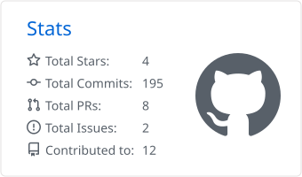
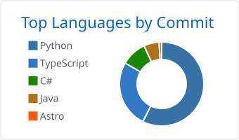

# Hi, I'm Zhiheng Wang

I build **AI systems, games, and software for myself**.

Currently interested in AI agents, applied AI engineering, game systems, and building small products that I actually use.

## Selected Projects

### 🎮 [SteamGuess](https://github.com/TraceOnSnow/SteamGuess)

A data-driven Steam game guessing game built around structured clues, configurable difficulty, player feedback, and real-time multiplayer.

`TypeScript` · `React` · `Node.js` · `SQLite` · `Socket.IO` · `Docker`

### 🃏 [HearthGen](https://github.com/TraceOnSnow/HearthstoneCardGenerator)

Knowledge-graph augmented Hearthstone card generation using structured card semantics, LLM-based design, and Stable Diffusion LoRA.

`Python` · `Knowledge Graph` · `LLM`  · `Stable Diffusion` · `LoRA`

### 📚 [Hayaku Shelf](https://github.com/TraceOnSnow/hayaku-shelf)

A self-hosted personal media library for cataloguing games, films, books, anime, places, and other experiences.

`Next.js` · `TypeScript` · `SQLite` · `Drizzle` · `Docker`

### 📋 [Manboard](https://github.com/TraceOnSnow/manboard)

A local-first spatial task workspace for humans and AI agents, with REST APIs and MCP integration.

`React` · `FastAPI` · `Python` · `MCP` · `Docker`

### 🔗 [Atlink](https://github.com/TraceOnSnow/Atlink)

A full-stack URL shortener built around a cached redirect architecture.

`Java` · `Spring Boot` · `React` · `Redis` · `Bigtable`

### 🌐 [Personal Homepage](https://github.com/TraceOnSnow/zhiheng-homepage)

My personal website, portfolio, writing space, and home for projects and experiments.

`Next.js` · `TypeScript` · `Tailwind CSS` · `MDX`

## GitHub Activity

 

---

<i>building things around AI, games, and personal software.</i>

